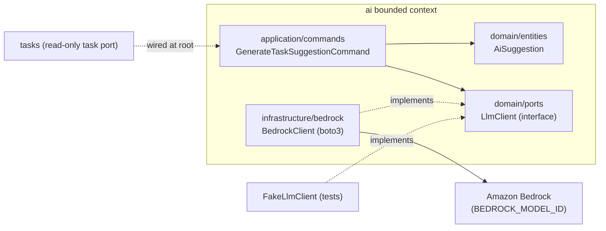

# AI Context

The `ai` context is a **peer bounded context** — sibling to `users` and `tasks`, not a feature
bolted onto either. It owns AI interactions (e.g. task suggestions) and keeps every LLM/AWS concern
behind a single port so that `tasks` and `users` stay completely free of Bedrock and `boto3`.

## The port: `LlmClient`

The domain layer defines an `LlmClient` **port** at
`contexts/ai/domain/ports/llm_client.py`. It is an interface only — the domain has **no awareness**
that Bedrock or AWS is the implementation. This is the Dependency Inversion Principle in practice:
the `ai` domain and application layers depend on an abstraction; the concrete AWS detail lives in a
single adapter.

## The entities

`AiSuggestion` (`contexts/ai/domain/entities/ai_suggestion.py`) models the inputs/outputs of an AI
interaction — prompt, response, and status. Value objects such as `PromptText` and
`ModelIdentifier` carry validated primitives. Whether suggestions are persisted is an explicit
choice (see below).

## The application layer

Use cases call the port, independent of how it is implemented. The headline command is
`GenerateTaskSuggestionCommand`. When it needs task context — "suggest a next task based on existing
ones" — it declares a constructor dependency on a **read-only task read port** satisfied by the
`tasks` context. That cross-context dependency is wired explicitly at the root
`ApplicationContainer` (`ai = providers.Container(AiContainer, ..., tasks=tasks)`), the same pattern
used for `tasks → users`. See [Bounded Contexts](bounded-contexts.md).

## The Bedrock adapter

`contexts/ai/infrastructure/bedrock/bedrock_client.py` implements the `LlmClient` port using the
`boto3` Bedrock Runtime client, scoped to `BEDROCK_MODEL_ID` from configuration. This file is the
**only** place in the entire codebase that knows AWS Bedrock exists.

Because the adapter is the sole AWS-aware component:

- It can be swapped (a different model, a different provider) without touching domain or
  application code.
- It is mocked in tests with a fake `LlmClient` — **no live Bedrock calls** in the unit or
  integration tiers. Live invocation is confined to a gated e2e/smoke suite. See
  [Testing](../development/testing.md).

## Persisted `AiSuggestion`

If suggestion history is persisted, the `ai` context adds an `AiSuggestionModel` under
`infrastructure/db/models/` using the **same `shared` base model** as every other context — meaning
it is tenant-isolated and covered by an RLS policy, exactly like `tasks` and `users` data. AI data
is not a special case for tenancy; it flows through the same claim → session var → RLS chain
described in [Multi-Tenancy](multi-tenancy.md).

## Exposure and security

The `ai` context is surfaced through its own `presentation/api/v1/ai/` router and an `ai` CLI
command, both going through the **same** authentication, authorization, and tenant-binding path as
every other request. At the infrastructure level, the AI pod runs under a dedicated IRSA role
scoped to `bedrock:InvokeModel` on specific model ARNs only — no broader Bedrock or S3 permissions.
See [ADR-0004](../adr/0004-ai-as-bounded-context.md) and
[ADR-0006](../adr/0006-least-privilege-iam-irsa.md).
