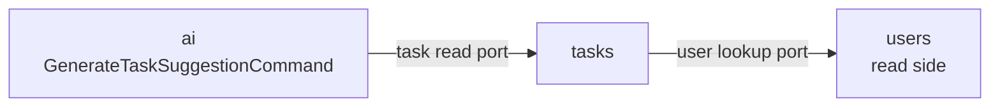

# Bounded Contexts

The application is partitioned into four bounded contexts under `src/todo_app/contexts/`. Each is a
self-contained vertical slice and owns its entire stack from domain logic to persistence.

| Context  | Responsibility | Notable ports / adapters |
|----------|----------------|--------------------------|
| `shared` | Cross-cutting kernel: base model, value objects (`Email`, `TenantId`), domain events, DB session, tenant context, Redis cache | `base_model.py`, `session.py`, `tenant_context.py` |
| `users`  | Identity, authentication, authorization | `UserRepository` port; Cognito JWT/JWKS integration in `infrastructure/auth/` |
| `tasks`  | Core TODO domain — the `Task` aggregate, status, due dates | `TaskRepository` port |
| `ai`     | Bedrock-backed AI interactions (e.g. task suggestions) | `LlmClient` port; Bedrock adapter |

## What "owns its vertical slice" means

Every context has the same internal shape:

```
contexts/<name>/
├── domain/           # entities, value objects, repository/port interfaces, services, events
├── application/      # commands (writes), queries (reads), DTOs
├── infrastructure/   # SQLAlchemy models, repositories, mappers, external adapters
└── container.py      # the context's composition root (e.g. UsersContainer)
```

`shared` is the kernel and skips a heavy `application/` layer — it provides reusable domain
primitives and infrastructure (DB session, tenant context, cache) that the other contexts build on.

## Isolation rules

The contexts are isolated by hard rules, enforced by `import-linter` (see [Layering](layering.md)
and [Governance](../development/governance.md)):

- **No context imports another context's internals.** `tasks` may not `import` from
  `users.domain` or `users.infrastructure`, and so on. The kernel (`shared`) is the only context
  every other context may depend on.
- **Cross-context access goes through explicit ports**, not direct imports. The consuming context
  declares an interface it needs; the providing context's adapter (or a thin read port) satisfies
  it; the wiring happens at the root.
- **Wiring is explicit and reviewable.** Coupling between contexts is visible at the
  `ApplicationContainer`, never hidden inside a flat container or a stray import.

## Cross-context ports

Two cross-context dependencies exist, both flowing one direction and both read-only:



- **`tasks → users`** — `tasks` needs to look up a user (e.g. to validate an owner). It depends on
  a read-only user lookup port satisfied by `users`. `tasks` never references the `User` entity
  directly; a `Task` carries a `UserId` value object, not a `User`, to preserve isolation.
- **`ai → tasks`** — `GenerateTaskSuggestionCommand` needs task context to produce a suggestion. It
  declares a read-only task read port satisfied by `tasks`.

These are uni-directional: there is no `users → tasks` or `tasks → ai` edge. The dependency graph
between contexts is acyclic.

## Wired at the root `ApplicationContainer`

Each context exposes its own container (`SharedContainer`, `UsersContainer`, `TasksContainer`,
`AiContainer`), independently instantiable and testable. `core/di/container.py` composes them and
passes cross-context dependencies as explicit sub-container arguments:

```python
# core/di/container.py
class ApplicationContainer(containers.DeclarativeContainer):
    config = providers.Configuration()

    shared = providers.Container(SharedContainer, config=config)
    users = providers.Container(UsersContainer, config=config, shared=shared)
    tasks = providers.Container(
        TasksContainer, config=config, shared=shared, users=users
    )
    ai = providers.Container(
        AiContainer, config=config, shared=shared, tasks=tasks
    )
```

The ordering encodes the dependency graph: `users` before `tasks` (because `tasks → users`),
`tasks` before `ai` (because `ai → tasks`). A unit test asserts no provider is left unwired,
including the cross-context bindings. The rationale for this two-tier composition is recorded in
[ADR-0001](../adr/0001-per-context-di-containers.md).

## Presentation and CLI consume contexts the same way

Both `presentation/api/` and `presentation/cli/` resolve use cases from the same
`ApplicationContainer`. A router and a CLI command invoke the *identical* command/query class —
business logic is never duplicated across channels.
