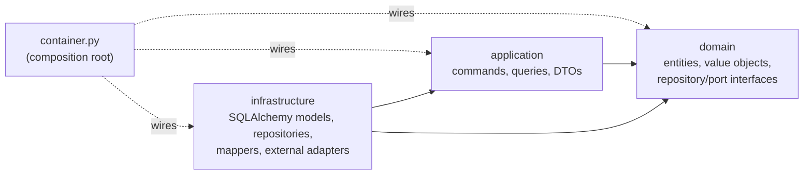

# Layering

Within every bounded context the dependency rule is strict and non-negotiable:

```
domain  ←  application  ←  infrastructure
```

The arrows point in the direction of the dependency: `application` depends on `domain`,
`infrastructure` depends on both, and nothing depends inward in the wrong direction.



## The layers

- **`domain/`** — pure Python. Entities (e.g. `Task`, `User`, `AiSuggestion`) are plain
  classes/dataclasses with no ORM and no Pydantic. Value objects (`UserId`, `Email`, `PromptText`),
  domain services, domain events, and **interfaces only** for repositories and ports live here.
  Zero framework dependencies.
- **`application/`** — use cases. `commands/` hold write use cases (e.g. `CreateTaskCommand`),
  `queries/` hold read use cases (e.g. `ListTasksQuery`), and `dto/` holds input/output DTOs. Each
  use case takes its repository/port via constructor injection and depends only on `domain/`
  interfaces — never on a concrete repository or an external SDK.
- **`infrastructure/`** — the implementations. SQLAlchemy models, repository implementations that
  satisfy the domain ports, entity ↔ ORM mappers, and external adapters (Cognito for `users`,
  Bedrock for `ai`).

## Why the direction matters

Pointing dependencies inward keeps the core of the system — the domain — ignorant of frameworks,
databases, and cloud providers. A use case can be unit-tested with an in-memory fake of a
repository port, with no DB, no AWS, and no FastAPI. The Bedrock client can be swapped for a fake
`LlmClient` in tests because the application layer only knows the port.

## `container.py` is the only exception

A composition root is structurally privileged: it is the **only** place allowed to "see" and wire
all three layers at once. That is why each context's `container.py` sits as a **sibling** to
`domain/`, `application/`, and `infrastructure/` — not nested inside `infrastructure/`. Nesting it
in `infrastructure/` would visually imply that `application` depends on `infrastructure`, inverting
the real rule. Keeping it a sibling makes the asymmetry explicit.

## Presentation purity

`presentation/api/` and `presentation/cli/` depend on `application/` only:

- They call commands and queries; they hold **no business logic**.
- **Serializers depend on domain entities, never on DB models.** A change to a SQLAlchemy model
  must not force an API contract change without an explicit mapper update. The HTTP boundary
  (serializers) and the application boundary (DTOs) are distinct objects that map cleanly to each
  other.
- A router or CLI command must not reach into `infrastructure/` or import a DB model directly.

## Enforcement: import-linter

These rules are not honor-system. `import-linter` contracts (configured in `pyproject.toml`) and
the tests under `tests/architecture/` verify them programmatically on every run of
`task check:architecture`:

- **Layered contract** per context — `domain` cannot import `application` or `infrastructure`;
  `application` cannot import `infrastructure`.
- **Independence contract** between contexts — `users`, `tasks`, and `ai` cannot import each
  other's internals.
- **Presentation contract** — `presentation` may import `application` (and `domain` types for
  serialization) but not `infrastructure` or DB models.
- **The `container.py` exception** — only `container.py` modules are permitted to import across all
  three layers of a context.

Because the boundaries are machine-checked, they cannot silently erode as the codebase grows. See
[Governance](../development/governance.md) for the full tooling pipeline.
