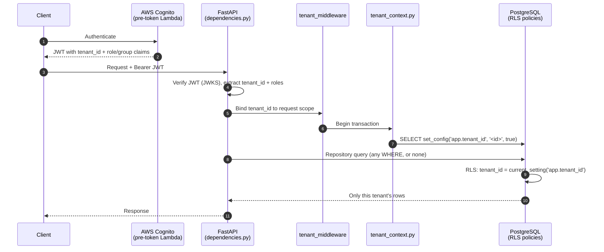

# Multi-Tenancy

The application is multi-tenant on a **shared PostgreSQL schema**: every tenant-owned table carries
a `tenant_id` column, and tenants are isolated by **PostgreSQL Row-Level Security (RLS)** — not by
application-layer `WHERE` filtering. Tenant context flows through three layers, and the database is
the actual enforcement boundary.

## The chain: claim → session var → RLS



## Layer 1 — Identity (AWS Cognito)

- A **single Cognito User Pool** serves the whole application — not per-tenant pools. Multi-tenancy
  is expressed through claims, not infrastructure duplication.
- A **pre-token-generation Lambda**
  (`infra/terraform/modules/cognito/pre_token_lambda/`) injects a `tenant_id` custom claim plus
  role/group claims into every issued JWT.
- The API verifies the JWT (JWKS fetch + cache) in `presentation/api/dependencies.py` and extracts
  `tenant_id` and the role/group claims. The Cognito integration itself lives in the `users`
  context at `users/infrastructure/auth/`.

## Layer 2 — Application (request → transaction binding)

- `presentation/api/dependencies.py` (`get_request_context`) extracts the verified `tenant_id` and
  binds it to a request **contextvar**, **ahead of any DB call**.
- `shared/infrastructure/db/unit_of_work.py` opens the transaction and
  `shared/infrastructure/db/tenant_context.py` issues
  `SELECT set_config('app.tenant_id', '<value>', true)` — the parameterized, transaction-local form
  (plain `SET LOCAL` cannot take a bound parameter). Scoped to the transaction, it cannot leak
  across pooled connections.

## Layer 3 — Database (PostgreSQL RLS)

- Every tenant-owned table has an RLS policy under `migrations/policies/*.sql` (e.g.
  `users_rls.sql`, `tasks_rls.sql`), applied via Atlas migrations. A representative policy:

  ```sql
  CREATE POLICY tenant_isolation ON tasks
    USING (tenant_id = current_setting('app.tenant_id')::uuid);
  ```

- The database itself rejects rows whose `tenant_id` does not match the session variable —
  **regardless of what a repository's query does or does not filter on**.

## Why RLS is the boundary, not the app layer

Application-layer filtering by `tenant_id` is **defense-in-depth**, not the source of truth. The
correctness of tenant isolation must not depend on every developer remembering to add a `WHERE
tenant_id = ...` to every query. With RLS, a repository bug — a missing filter, a raw query, a join
that forgets the scope — **cannot** leak cross-tenant data, because the database refuses the rows.
The rationale is recorded in [ADR-0003](../adr/0003-rls-over-app-layer-tenancy.md).

## Authorization is separate

Role/group claims from Cognito drive **authorization** (permission checks) and are handled
separately from the tenant isolation mechanism. Tenancy answers *which rows you can see*;
authorization answers *what actions you may perform*. They are deliberately kept distinct.

## Testing it

A dedicated **RLS isolation test** (in `tests/integration/`) asserts that a query run under one
tenant's session variable returns **zero** rows from another tenant — even with an unfiltered
query. Because RLS is a real PostgreSQL feature, this test requires a real Postgres instance
(`TEST_DATABASE_URL`); it cannot run against SQLite. See [Testing](../development/testing.md).
