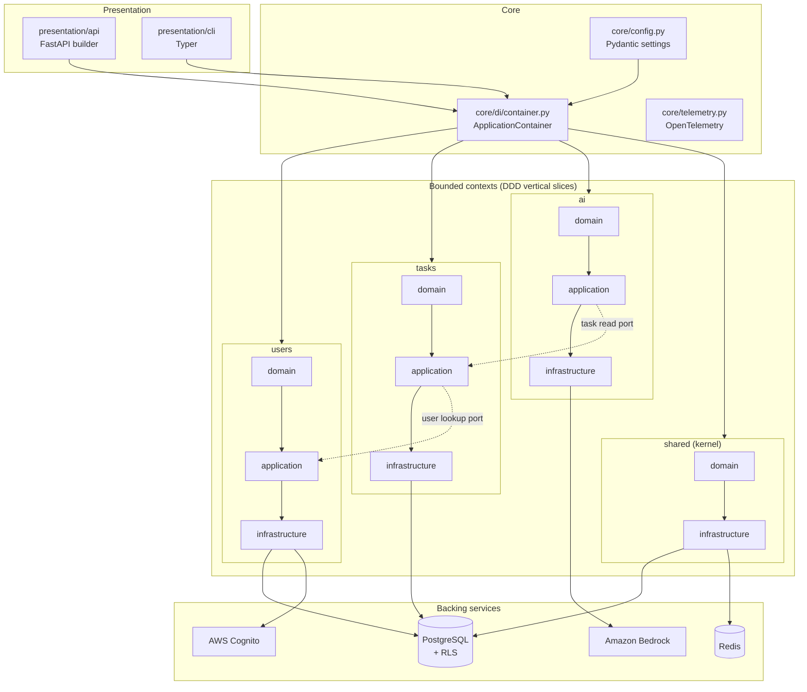

# Architecture Overview

The TODO App is a **modular monolith** built with **Domain-Driven Design**. It ships as a single
deployable unit, but internally it is partitioned into bounded contexts that are independently
testable, independently reasoned about, and — in principle — independently extractable into
services if that ever becomes necessary.

This page is a high-level summary. The authoritative narrative lives in the repository root planning
docs — `copier-plan.md`. Read those for the full detail; this page orients
you.

## Design principles

The structure exists to serve **SOLID, DRY, KISS, and YAGNI**. Patterns (builder, ports &
adapters, CQRS, dependency injection) are used only where they remove real coupling or
duplication. Abstraction added for a hypothetical future need is treated as a defect, not
sophistication.

## The shape of the system

The application lives under `src/todo_app/`. There are three structural tiers:

- **Bounded contexts** (`contexts/{shared,users,tasks,ai}/`) — each a full vertical slice of
  `domain/`, `application/`, `infrastructure/`, plus a `container.py` composition root.
- **Presentation** (`presentation/{api,cli}/`) — a FastAPI app built with a builder pattern and a
  Typer CLI. Both consume the same `application/` use cases; neither holds business logic. The API
  paginates list endpoints (`Page`/`PageResponse`), caches GET-by-id reads in Redis (invalidated on
  writes), and applies a Redis-backed rate-limit middleware. One-shot ops jobs (e.g. data seeding)
  live in `scripts/` and run as init containers, not CLI commands.
- **Core** (`core/`) — `config.py` (Pydantic settings), `di/container.py` (the root
  `ApplicationContainer`), `logging.py`, and `telemetry.py` (OpenTelemetry).

Within every context the dependency rule is strict: `domain → application → infrastructure`, never
reversed, and only `container.py` is allowed to import across all three layers. See
[Layering](layering.md).

## Cross-cutting concerns

- **Identity & tenancy** — a single Cognito User Pool issues JWTs carrying a `tenant_id` claim and
  role/group claims. That `tenant_id` is bound to the DB transaction and enforced by PostgreSQL
  Row-Level Security. See [Multi-Tenancy](multi-tenancy.md).
- **AI** — the `ai` context depends on an `LlmClient` port; the Bedrock adapter is the only place
  that knows AWS exists. See [AI Context](ai-context.md).
- **Persistence** — a `shared` base model standardizes soft delete (`deleted_at`), audit fields,
  timestamps, and the `tenant_id` column on every tenant-owned table.
- **Composition** — per-context containers wired by a root `ApplicationContainer`. See
  [Bounded Contexts](bounded-contexts.md) and [ADR-0001](../adr/0001-per-context-di-containers.md).

## Why these choices

The non-obvious decisions are captured as [Architecture Decision Records](../adr/index.md):
per-context DI containers, Cognito over Keycloak, RLS over app-layer tenancy, AI as a bounded
context, DB init as a separate Job, and least-privilege IAM via IRSA.
