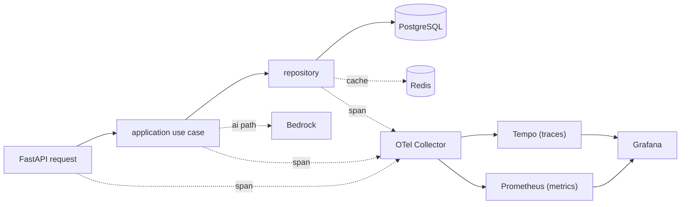

# Observability

The application is instrumented with **OpenTelemetry** for distributed tracing and metrics, exported
through an OTel Collector to a **Grafana / Tempo / Prometheus** stack.

## Instrumentation

OpenTelemetry is wired into `core/telemetry.py`, which instruments:

- **FastAPI** — inbound HTTP requests (the trace root).
- **SQLAlchemy** — database queries, so a slow query shows up inside the request trace.
- **Redis** — cache operations.
- **Outbound AWS calls** — Cognito (JWKS/auth) and Bedrock (`ai` context invocations).

A request is traceable end-to-end as a single trace:

## Collector

The OTel Collector configuration lives at `observability/otel-collector-config.yaml`. It receives
traces and metrics from the application and exports them to the backends — **Tempo** for traces and
**Prometheus** for metrics.

## Dashboards

Grafana dashboards under `observability/grafana/dashboards/` visualize the golden signals:

- **Request latency** (per endpoint).
- **Error rate**.
- **DB connection pool saturation**.
- **Cache hit rate**.

## What "good" looks like

A single request — API → application use case → repository → DB — appears as **one trace** in
Grafana/Tempo, with spans for the HTTP handler, the use case, the SQLAlchemy query, and any Redis or
Bedrock calls along the way. This is the acceptance bar for the observability layer: any request can
be followed across every layer it touches without correlation guesswork.
